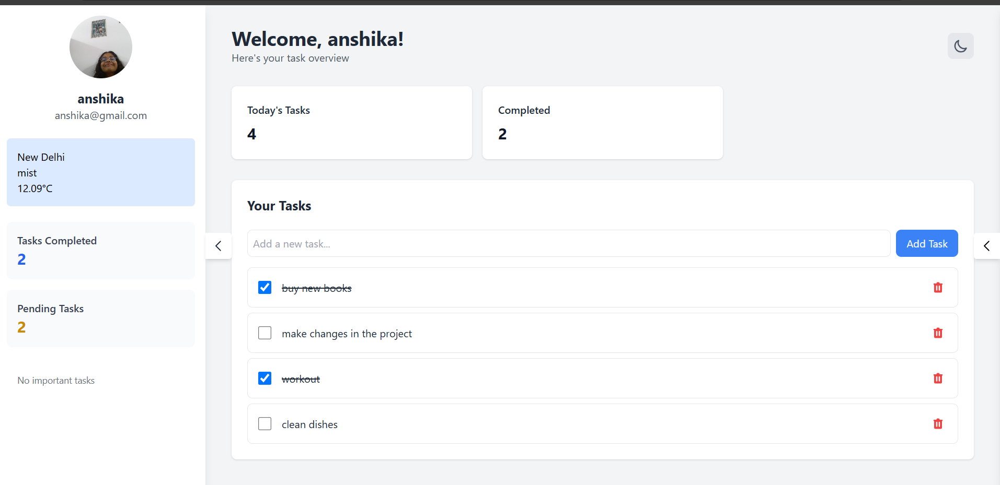
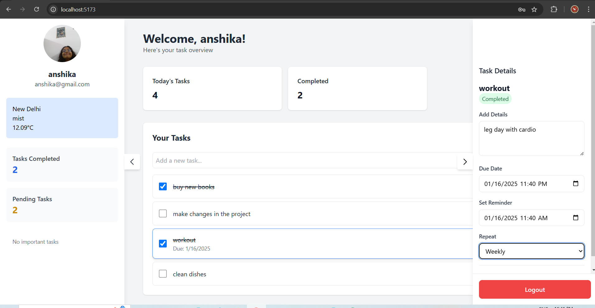
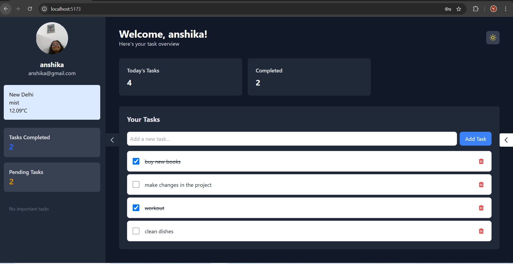
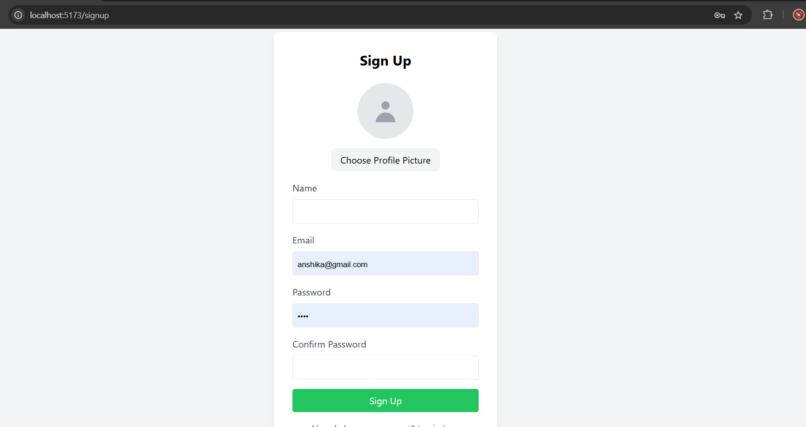

# TaskMaster - Modern Task Management App

A sleek and intuitive task management application built with React, Redux, and Tailwind CSS. TaskMaster helps you stay organized and productive with a clean interface and powerful features.

 **:: Integrated with OpenWeather API to know the weather of the city**

## ✨ Features

- **Task Management**
  - Create, edit and delete tasks
  - Mark tasks as complete/incomplete
  - Flag important tasks
  - Add detailed notes to tasks
  - Set due dates and reminders

- **Smart Organization**
  - Tells the weather of the city
  - Task categorization
  - Priority flags
  - Due date tracking
  - Recurring task options

- **User Experience**
  - Clean, modern UI
  - Dark/light theme support
  - Responsive design
  - Task statistics dashboard
  - Intuitive sidebar navigation

- **Data Persistence**
  - Local storage integration
  - User authentication
  - Secure data handling

## 📸 Screenshots 

*Main dashboard view showing task list and statistics*

 
*Detailed task view with editing options*

*Dark theme support for comfortable viewing*

*Signup page*

